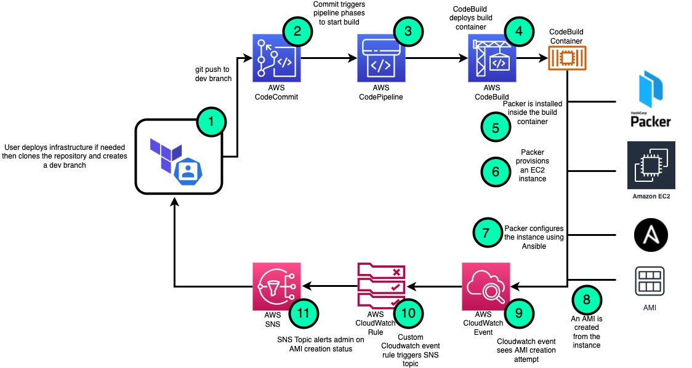

### Work In Progress
## Workflow

## Instructions 

# Scenario 1: Creating a new VPC with this code
Running `terraform apply` from the root directory, as is, will build a new VPC with 2 public subnets that auto assign public IPs, 1 private subnet, an IGW and a NATGW. If you choose to use an existing VPC, continue to scenario 2.

1. Clone this repository and fill in your values in `vpc.tf` and `pipeline.tf`
2. From the root directory of this project, type `terraform init`, `terraform plan`, and then `terraform apply`
3. Upon successful creation of the resources, verify you have a CodeCommit repo, CodeBuild project, and CodePipeline.
4. You should also recieve a confirmation email at the email address you used for the `email_address` variable. You are required to confirm the SNS topic subscription to recieve build alerts for this pipeline. Confirm it upon a successful terraform apply. 
5. Copy the CodeCommit HTTPS URL from the output of the terraform apply command, or from the CodeCommit console.
6. Git clone the project to your local host. This may require your CodeCommit credentials from AWS.
7. You will be warned that you have cloned an empty repository. This is normal. Copy the contents of this project: https://github.com/Josh-Tracy/terraform-aws-packer-configurations to the empty one you just cloned.
7. Create a branch named after the branch that CodePipeline is watching `git checkout -b dev`
8. `git add .` then `git commit -m "test"` then `git push --set-upstream origin dev`. You may be prompted for your AWS CodeCommit credentials again.
9. Once the commit is pushed, you should see a build running under CodeBuild.
10. Upon completion of the build, you should recieve an alert to the email address you chose for the `email_address` variable.

Congratulations! You have just created a CI/CD pipeline for updating AMIs on AWS. The concept for future updates to AMIs is the same. You have a pipeline watching a repository branch for a commit, which triggers a build, and in turn uploads artifacts to S3 and a new AMI while alerting devs and admins. 

# Scenario 2: Using with an existing VPC
If you have an existing VPC, you will need to import the VPC ID, and any other resource ids, arns, names, etc. that you do not want to create from scratch. To do so use the terraform import command where needed using the format below:

- `terraform import aws_vpc.vpc <vpc_id>` aws_vpc.vpc references the vpc resource defined in the vpc module, while `<vpc_id>` should be replaced with your existing VPC-ID. 

## Requirements

| Name | Version |
|------|---------|
|  [terraform](#requirement\_terraform) | >= 1.0.6 |
| aws | >= 3.71.0 |

## Providers

| Name | Version |
|------|---------|
| aws | >= 3.71.0 |

## Inputs - vpc.tf

| Name | Description | Type | Default | Required |
|------|-------------|------|---------|:--------:|
| vpc_cidr_block | CIDR Block for the VPC | `string` | `null` | yes |
| vpc_name | Name of the VPC | `string` | `null` | yes |
| subnet_a_cidr | CIDR for public subnet A | `string` | `null` | yes |
| subnet_a_az  | Availability Zone for public subnet A | `string` | `null` | yes |
| public_subnet_a_name| Sets the name of public subnet A | `string` | `null` | yes |
| subnet_b_cidr| CIDR for public subnet B | `string` | `null` | yes |
| subnet_b_az | Availability Zone for public subnet B | `string` | `null` | yes |
| public_subnet_b_name | Sets the name of public subnet B | `string` | `null` | yes |
| subnet_c_cidr | CIDR for PRIVATE subnet C | `string` | `null` | yes |
| subnet_c_az | Availability Zone for PRIVATE subnet C | `string` | `null` | yes |
| private_subnet_c_name | Sets the name of PRIVATE subnet C | `string` | `null` | yes |
| igw_tag_name | Internet Gateway Name tag | `string` | `null` | yes |
| natgw_tag_name | NAT Gateway Name tag | `string` | `null` | yes |
| subnet_a_routetable_tag_name | Sets the name of subnet A routetable | `string` | `null` | yes |
| subnet_b_routetable_tag_name | Sets the name of subnet B routetabley | `string` | `null` | yes |
| subnet_c_routetable_tag_name | Sets the name of subnet C routetable | `string` | `null` | yes |
| subnet_a_routetable_cidr | Subnet A CIDR for traffic flow | `string` | `null` | yes |
| subnet_b_routetable_cidr | Subnet B CIDR for traffic flow | `string` | `null` | yes |
| subnet_c_routetable_cidr | Subnet C CIDR for traffic flow | `string` | `null` | yes |
| sg_name_https | Sets the name of the security group | `string` | `null` | yes |
| ssh_ingress_rule_description | Description for this security group rule | `string` | `null` | yes |
| ssh_from_port | Port for SSH | `number` | `null` | yes |
| ssh_to_port | Port for SSH | `number` | `null` | yes |
| ingress_ssh_cidr | CIDR to allow traffic from on this rule | `string` | `null` | yes |
| https_ingress_rule_description | Description for this security group rule | `string` | `null` | yes |
| https_from_port  | HTTPS Port | `number` | `null` | yes |
| https_to_port | HTTPS Port | `number` | `null` | yes |
| ingress_https_cidr | CIDR to allow traffic from on this rule | `string` | `null` | yes |
| http_ingress_rule_description | Description for this security group rule | `string` | `null` | yes |
| http_from_port   | HTTP port | `number` | `null` | yes |
| http_to_port | HTTP port | `number` | `null` | yes |
| ingress_http_cidr | CIDR to allow traffic from on this rule | `string` | `null` | yes |

## Inputs - pipeline.tf

| Name | Description | Type | Default | Required |
|------|-------------|------|---------|:--------:|
| codecommit_repository_name | Sets the name of the CodeCommit Repository | `string` | `null` | yes |
| codecommit_repository_description | Sets the description for the CodeCommit repository | `string` | `null` | yes |
| branch | The branch for CodePipeline to begin building when a commit is detected. | `string` | `null` | yes |
| pipeline_deployment_bucket_name | Name of the S3 bucket that will store CodePipeline artifacts | `string` | `null` | yes |
| codepipeline_role_name | The role name for CodePipeline IAM role | `string` | `null` | yes |
| codepipeline_policy_name | The policy for the CodePipeline IAM policiy | `string` | `null` | yes |
| account_type | Human readable name of the targets accounts | `string` | `null` | yes |

## Outputs

| Name | Description |
|------|-------------|
